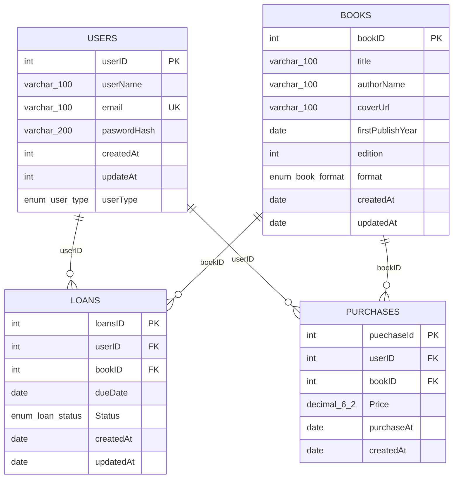

# Library App ERD

## Notes

- `USERS.email` has a unique index (`email_unique`).
- SQL exact types:
- `USERS.userName` and `USERS.email` are `varchar(100)`, `USERS.paswordHash` is `varchar(200)`, `USERS.userType` is `set('regular','admin')`.
- `BOOKS.title`, `BOOKS.authorName`, `BOOKS.coverUrl` are `varchar(100)`, `BOOKS.format` is `set('Digital','Physical')`.
- `LOANS.Status` is `set('In progress','Finished')`.
- `PURCHASES.Price` is `decimal(6,2)`.
- `LOANS.userID -> USERS.userID` (`userID_FK_loans`).
- `LOANS.bookID -> BOOKS.bookID` (`bookID_FK_loans`).
- `PURCHASES.userID -> USERS.userID` (`userID_FK`).
- `PURCHASES.bookID -> BOOKS.bookID` (`bookID_FK`).
- All foreign keys are `ON DELETE RESTRICT` and `ON UPDATE RESTRICT`.
